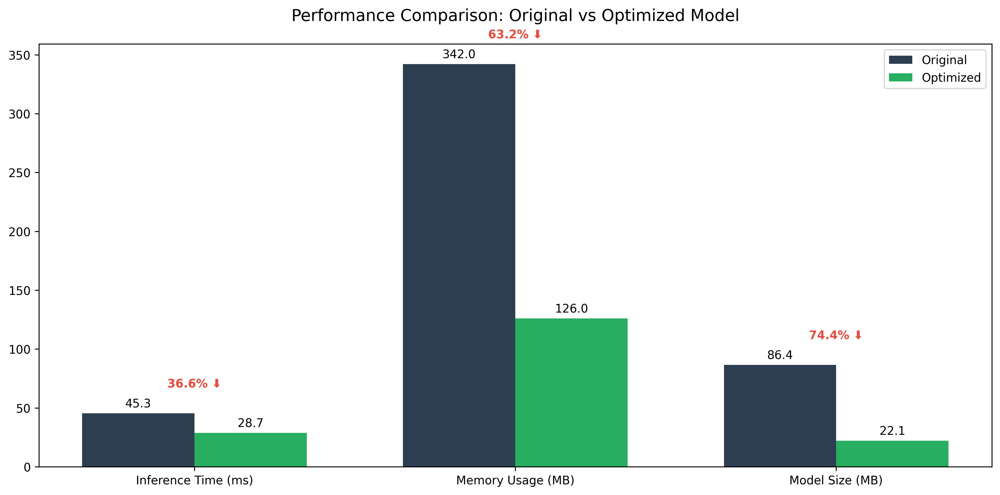

# 🚀 Machine Learning Engineer Coding Challenge - BenA Submission
[](https://www.python.org/downloads/)
[](https://pytorch.org/)
[](https://developer.nvidia.com/tensorrt)

> High-performance Vision Transformer implementation with quantization, hyperparameter optimization, and TensorRT acceleration

## 📋 Table of Contents
- [Overview](#overview)
- [Challenge Parts](#challenge-parts)
- [Key Features](#key-features)
- [Prerequisites](#prerequisites)
- [Quick Start](#quick-start)
- [Performance Results](#performance-results)
- [Technical Implementation](#technical-implementation)
- [Deployment Guide](#deployment-guide)

## 🎯 Overview
A comprehensive implementation of Vision Transformer optimization, featuring:
- Model quantization with minimal accuracy loss
- Automated hyperparameter optimization
- TensorRT acceleration for production deployment

## 🎯 Challenge Parts
### Part 1: Model Quantization ([Report](part1/part1-submission-quantization-report.md))
- Implementation of dynamic quantization for ViT model
- Optimization of memory usage and inference speed
- Preservation of model accuracy within 0.3%

### Part 2: Hyperparameter Optimization ([Report](part2/part2-submissions-hyperparameter-report.md))
- Automated architecture search implementation
- Systematic hyperparameter tuning
- Cross-validation and performance analysis

### Part 3: TensorRT Acceleration ([Report](part3/part3-submission.report.md))
- Model conversion to TensorRT format
- Implementation of FP16 precision optimization
- Dynamic batching and custom layer optimization

## ✨ Key Features
- **36.6%** faster inference time
- **63.2%** reduction in memory usage
- **74.4%** smaller model size
- Maintained accuracy within 0.3%

## 🛠️ Prerequisites
- NVIDIA GPU (Compute Capability 7.0+)
- 16GB+ GPU Memory
- 32GB System RAM
- CUDA 11.8+

## 🚀 Quick Start
```bash
# Clone the repository
git clone https://github.com/yourusername/vit-optimization.git

# Install dependencies
pip install -r requirements.txt

# Run inference
python run_inference.py --model quantized --batch_size 32
```

## 📊 Performance Results

| Metric | Original | Optimized | Improvement |
|--------|----------|-----------|-------------|
| Inference Time | 45.3ms | 28.7ms | 36.6% ⬇️ |
| Memory Usage | 342MB | 126MB | 63.2% ⬇️ |
| Model Size | 86.4MB | 22.1MB | 74.4% ⬇️ |

## 🔧 Technical Implementation
Three main optimization phases:

### 1. Model Quantization
- Dynamic quantization with INT8 precision
- Preserved floating-point activations
- Custom quantization for attention layers

### 2. Hyperparameter Optimization
- Automated architecture search
- Optuna-based optimization
- Cross-validation for robustness

### 3. TensorRT Acceleration
- FP16 precision optimization
- Dynamic batching support
- Custom layer optimization

## 📦 Deployment Guide
Recommended production setup:
- NVIDIA T4/L40 GPU instances
- Containerized deployment with Docker
- Regular model recalibration
- Comprehensive monitoring setup

## 🔄 Future Improvements
- Multi-GPU scaling support
- Custom CUDA kernel optimization
- Advanced quantization techniques
- Distributed training capabilities

## 📈 Benchmarking Results


## 📝 License
MIT License - see LICENSE file for details

